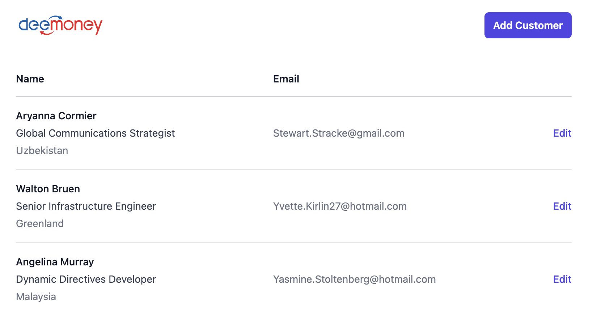
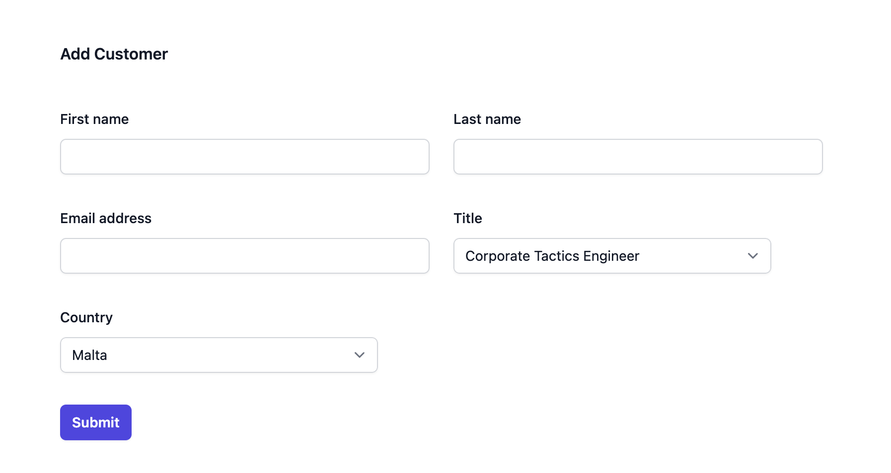
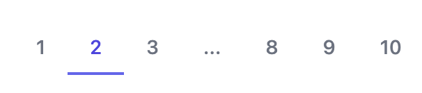

# DeeMoney Frontend Challenge

Our frontend dev was working on cutomer list page but our dev is on vacation leave.

Assuming you are a new joiner and you are assigned to continue working on this task.

## What our dev have done
- Show customers list without functionality
  - Basic UI with tailwind
  - Fetching customers from API
    - GET - `/customers`
  - Fetching countries from API
    - GET - `/countries`
- Please start app with cmd `npm run dev` to see the UI

## What do we expect
- Features

  - Add Customer
    - When user click add customer, show the popup to add a new customer and click submit then send data to API
      - POST - `/customers`, payload - Please see `Customer`type in codebase
    - Add X icon into popup to close the popup
  - Edit Customer
    - When user click edit, show the popup to edit customer and click submit then send data to API
      - PATCH - `/customers/:id`, payload - Please see `Customer`type in codebase
    - Add X icon into popup to close the popup
- Refactor and build up the features with proper project structure
  - Show us what you got !
- Feel free to use library to speed up the challenge

## Bonuses (Good to have, If you want more challenges)
- Add Form Validation
- Error Handling
- Beautify visual
- Create Pagination
  
  
